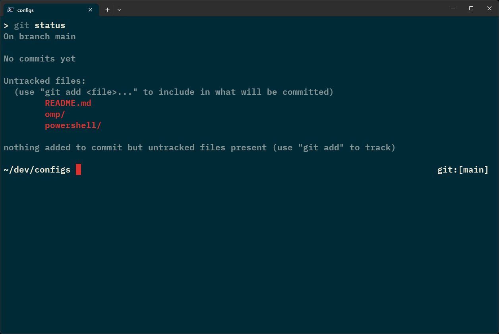

# Configs

I'd call them dotfiles but art software only works on Windows.

## Env

`$CONFIGS` points to a local copy of this repo.

## Powershell

```powershell
echo ". `$env:CONFIGS/powershell/psrc.ps1" > $PROFILE
```

## [Oh My Posh](https://ohmyposh.dev/)

### minimal.omp.json


